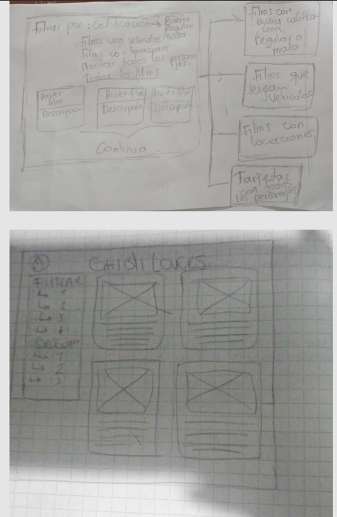

#DATA LOVERS

##Definición de producto
Basandonos en la tematica escogida (STUDIO GHIBLI), decidimos crear una fan page para fanaticos de este
estudio de animación. Para esto realizamos unas preguntas a 8 posibles usuarios, de esta manera obtuvimos la información necesaria sobre que esperaba el usuario de la fan page, y asi filtramos los datos en común y pudimos definir nuestras historias de usuario.

##Preguntas a los usuarios

##Historias de Usuario
Para crear las historias de usuario filtramos esta informacion en común de las respuestas de los usuarios:
-Poder Interactuar con otros users
-Ver datos curiosos
-Sinopsis de las peliculas
-Ver todos los personajes de las peliculas
-Datos de los personajes
-Diseños o ilustraciones acorde a las peliculas
-Ordenar por lanzamiento
-Ordenar por personajes
-check para marcar peliculas 

**Historia de Usuario 1**:

**YO COMO**:  “ Fan  de studio ghibli”

**QUIERO**: Una bienvenida atractiva”

**PARA**: “ ver imagenes y un listado de peliculas”

**Criterios de Aprobación**

-El Usuario tiene una pagina de bienvenida con mucho contenido visual.

-El usuario puede ingresar su nombre

-El usuario recibe un saludo de bienvenida

-El usuario puede ingresar al listado de peliculas atraves de un botón

**Definición de terminado**
-El codigo muestra una pagina de bienvenida con variedad de imágenes y un listado de las películas.
-El código esta permitiendo escribir el nombre al usuario.
-Los botones cumplen con su funcionaldad
-El codigo esta mostrando un texto de bienvenida

**Historia de Usuario 2**:

**YO COMO**:  “ Fan  de studio ghibli”

**QUIERO**: “una pagina con variedad de filtros”

**PARA**: “ escoger de acuerdo a mis gustos”

**Criterios de Aprobación**

-El Usuario tiene un boton para filtrar por locaciones

-El Usuario tiene un boton para filtrar por personajes

-El Usuario tiene un boton para filtrar por rt-score

-El Usuario tiene un boton para filtrar por vehiculos

-El Usuario tiene un boton para ordenar por año

-El Usuario tiene un boton para ordenar alfabeticamente A-Z / Z-A

**Definición de Terminado**
-El código permite al usuario filtrar y ordenar
-Cada filtro tiene su funcionalidad en un boton asignado
-Cada orden tiene su funcionalidad con su boton asignado
-Las tarjetas se muestran según el filtro u orden seleccionado
**Historia de Usuario 3**:

**YO COMO**:  “ Fan  de studio ghibli”

**QUIERO**: “Ver informacion o sinapsis”

**PARA**: “Saber el nombre de las peliculas y entender de que se tratan”

-El Usuario puede ver la sinapsis al reverso de las tarjetas

-El usuario puede ver un poster de la pelicula

-El usuario tiene datos de la pelicula tales como:
*Nombre*

*Año de lanzamiento*

*RT Score*

*Director*

**Definición de terminado**
-El código permite que las tarjetas giren para mostrar la información.
-El usuario puede visualizar información como titulo, año, director, y al girar la tarjeta puede ver la sinopsis de la pelicula para ver de que se trata.
-El código nos permite visualizar el poster de cada pelicula.
-El código nos permite volver a la pagina inicial.

Nuestra Fan Page en gran medida resuelve los requerimientos hechos por los usuarios, al tener una variedad de filtros y de opciones para ordenar las peliculas basandose en los datos relevantes, la información es mostrada con suficiente ilustración y es explicita, de esa manera es accesible y facil de manejar para el usuario.

**Prototipos de baja fidelidad**

**Prototipos de Alta fidelidad**

Primeros prototipos de alta fidelidad

A medida que fuimos avanzando en el proyecto, iteramos los diseños de nuestros prototipos:

 

